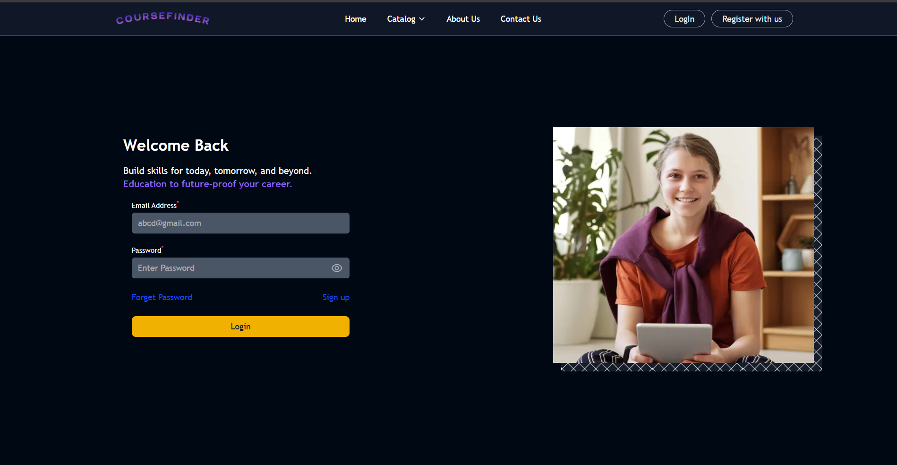
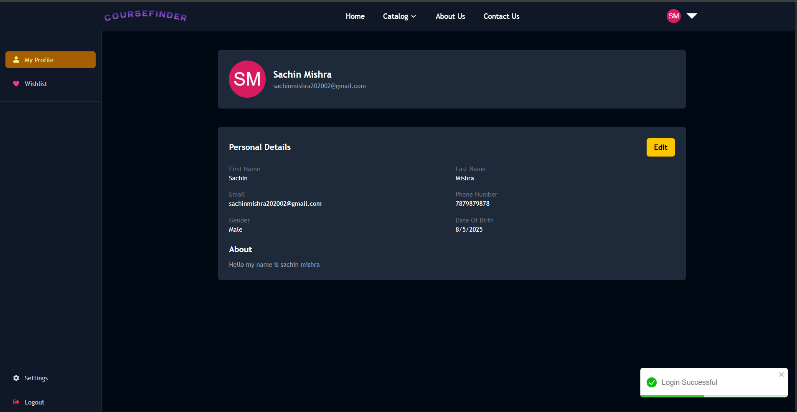
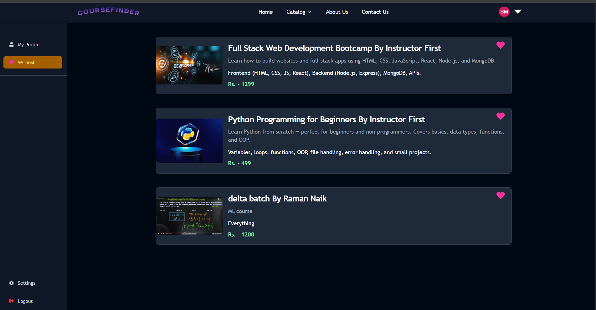
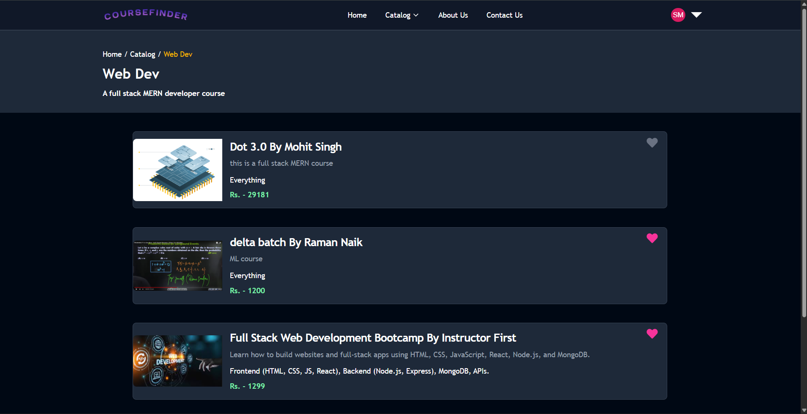
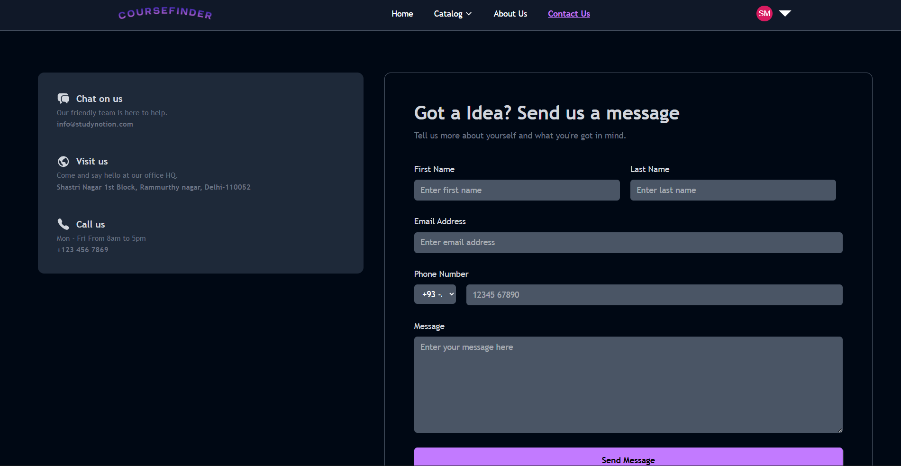

# 📚 CourseFinder

CourseFinder is a **centralized advertisement hub for courses**, where creators can list their courses (with details, pricing, and external links) and explorers can search, compare, and review them.

The project ensures a **secure authentication flow with email-based OTP verification (via Google Mail SMTP)**, providing a smooth and reliable user experience.

---

## 🧰 Tech Stack

* **Frontend**: React + Vite + Tailwind CSS 
* **Backend**: Node.js + Express.js
* **Database**: MongoDB (Mongoose)
* **Authentication**: Email OTP (nodemailer) + JWT
* **State Management**: Redux Toolkit
* **Toast Notifications**: react-toastify
* **Deployment**: Frontend on Vercel, Backend on Render

---

## ✨ Features

* 🔐 Secure user authentication with OTP verification
* 👨‍🏫 Creator role: Add and manage courses
* 🔎 Explorer role: Browse, search, and compare courses
* ⭐ Reviews and ratings system for feedback
* 📊 Organized course listings with summaries, price, and external links
* 🎨 Modern, responsive UI with Tailwind CSS

---

## 📺 Live Demo

> `https://course-finder-nu.vercel.app/`

---

## 📸 Screenshots

<table>
  <tr>
    <td>
        
    </td>
    <td>
        
    </td>
  </tr>
  <tr>
    <td>
        
    </td>
  </tr>
  <tr>
    <td>
        
    </td>
    <td>
        
    </td>
    <td>
        
    </td>
  </tr>
  <tr>
    <td>
        
    </td>
  </tr>
</table>

---

## 🛠️ Getting Started

### 1. Clone the Repo

```bash
git clone https://github.com/MohitSingh-1/Course-Finder.git
cd Course-Finder
```

### 2. Setup Frontend

```bash
npm install
```

### 3. Setup Backend

```bash
cd server
npm install
```


### 4. Run 

```bash
npm run dev
```

---

## 🔐 Environment Variables

Create `.env` files in both `backend` and `frontend`.

### 🔧 Backend `.env`

```env
PORT = 4000
DATABASE_URL = your_mongodb_connection_string
JWT_SECRET = your_jwt_secret

# secrets to send the email
MAIL_HOST = your_mail_host
MAIL_USER = your_mail_user_name
MAIL_PASS = your_mail_password

# secret for the cloudinary image(thumbnail) uploads
FOLDER_NAME = your_folder_name_on_cloudinary
CLOUD_NAME = your_cloud_name
API_KEY = Your_key
API_SECRET = Your_secret

```

### 🔧 Frontend `.env`

```env
VITE_BASE_URL = http://localhost:4000/api/v1
```

---

## 🗂️ Folder Structure

```
coursefinder/
├─ server/                 # Backend (Express)
│  ├─ config/
│  ├─ controllers/
│  ├─ middlewares/
│  ├─ models/
│  ├─ routes/
│  ├─ utils/
│  └─ index.js
├─ src/                    # Frontend (React)
│  ├─ components/
│  ├─ pages/
│  ├─ services/
│  ├─ slices/
│  ├─ assets/
│  └─ main.jsx
├─ .env
├─ package.json
└─ README.md

```

---

## 👨‍💼 Author

**Mohit Kumar Singh** – [@mohitsingh](https://github.com/MohitSingh-1)
Feel free to reach out for collaboration or questions!

---
